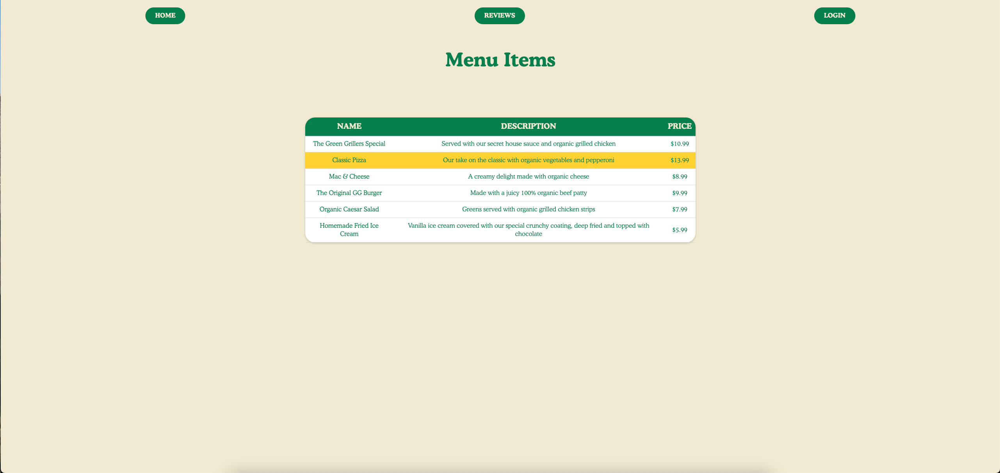
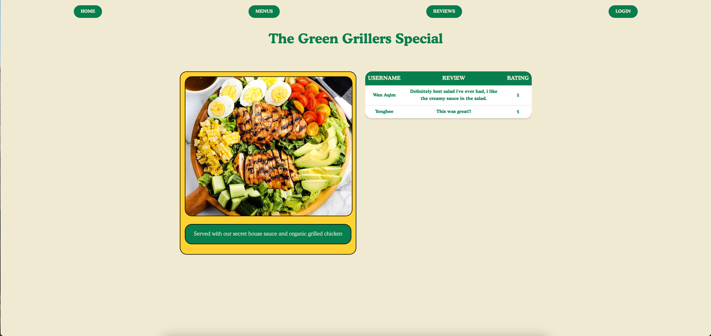
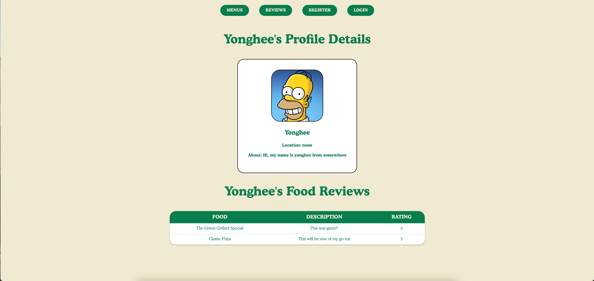

# Restaurant Food Review Website

Welcome to our 420 Burger Joint Restaurant Website, a website designed to offer a seamless food review experience. Users can browse menu, read and share reviews, and engage with our food-loving community. Additionally, users can personalize their experience through their own profiles.

## Features

- **User Profiles**: Create your own profile, share your location, and tell us about your food preferences.
- **Food Reviews**: Share your thoughts on different dishes, with ratings and descriptions.
- **Photo Uploads**: Add pictures of profile picture with easy upload features, powered by Cloudinary.
- **Food Reviews Page**: Find reviews for the specific dish you're interested.
- **User Profile Show Page**: Find users from the review section to see their profile details and food reviews submitted by them.

## Screenshots

## Technologies

### Software Used:
- Microsoft VS Code : Version 1.84.0
- Github
- Google Chrome : Version 118.0.5993.117

### Backend Software
- Node.js
- Express.js
- MongoDB
- Cloudinary : Version 1.41.0
- Passport-Local (For Authentication)

### Language Used:
- JavaScript : Version ES13 ECMAScript 2022
- CSS3 : Version W3 CSS 4.15
- HTML : Version 5

### Operating System:
- macOS : Sonoma 14.1

## Getting Started

### URL
https://burger-joint-420-ac07f85baca0.herokuapp.com/

## Other
This Project was created under course "Software Engineering Immersive" presented by student of General Assembly Australia